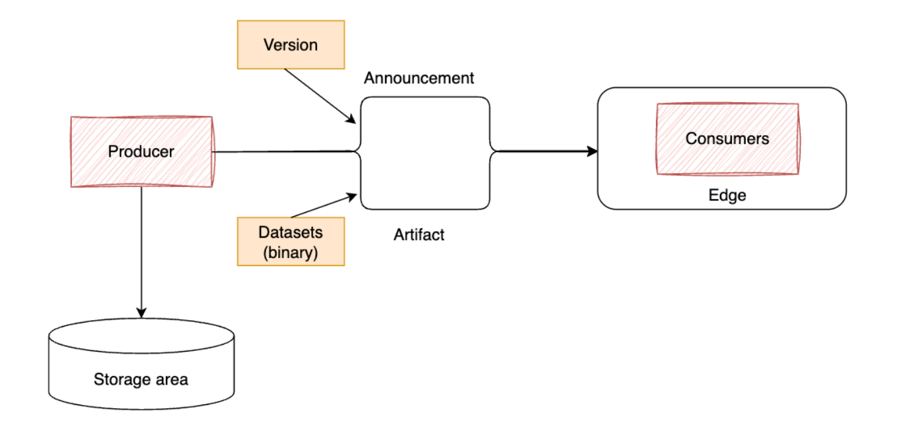
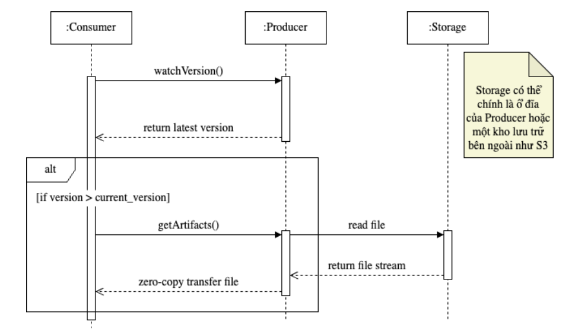

# Introduction

This is a Java Library for disseminating dataset from `single producer to many consumers` and cache data in-memory.

The detail of designing could be found at [report-doc](./docs/19521574.pdf).

# Overview
One problem of distributed system is to caching data efficiently, there are two ways caching dataset.

- Distributed caching: use an external tool (like Redis, Memcached) in order to centralized dataset, this approach have latency for each query and put much pressure on networking infrastructure (bandwidth, latency, distance, ...).

- Local caching: keep dataset in-memory locally, this appoach has scaling challenges in growing size of data: the heap footprint of dataset grows, updating requires CPU resources or impact GC behavior.

We decide to develope library for harnessing small to medium sized in-memory dataset which can be transfer from a single producer to many consumer for read-only access. Some important aspects should be considered:

- Performance: focus narrowly on keeping entire, read-only dataset in-memory on consumers. We apply encoding algorithms to serialize data into binary format instead of XML or JSON (which can consumer more storage space).

- Agility: have potential to keep tracking of dataset, implement your own infrastuture by declaring required interfaces.

- Stability: dataset for each version is stored in seprate binary file, we use delta-load to apply changes from version 1, 2,..., n. In that way, at any point, a consumer can restart and have the same state with others after failure. Moreover, we can rollback for any unexpected published version.

Overview of infrastructure

- Producer take responsibility to create a Cobra model which is then transferred to consumers/clients via dataset binary files for each release version.

- Consumers/clients watch for each change of version on producer (polling like Kafka).

Sequence diagram

# Concepts

- Off-heap memory: omit the impact of GC on data storage in Java, beside that, the dataset is dependent on physical RAM but not Heap of Java.

- Socket IO: an own package to implement requirement for transfering/sending data.

    - Using Netty to leverage non-blocking IO and zero-copy for transfering dataset.

    - Apply pull-based model for checking new version of dataset.

- SLAB algorithm: use slab to allocate/free memory.